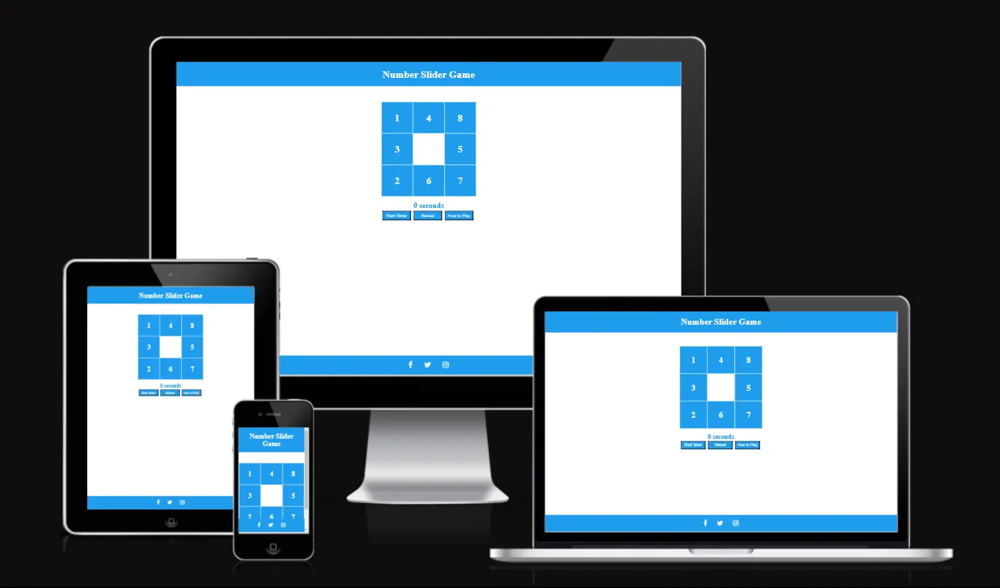
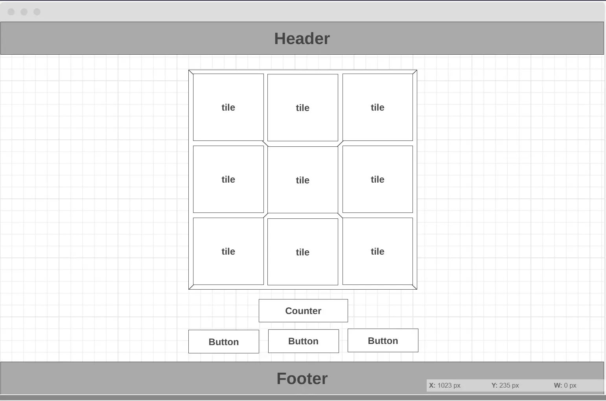
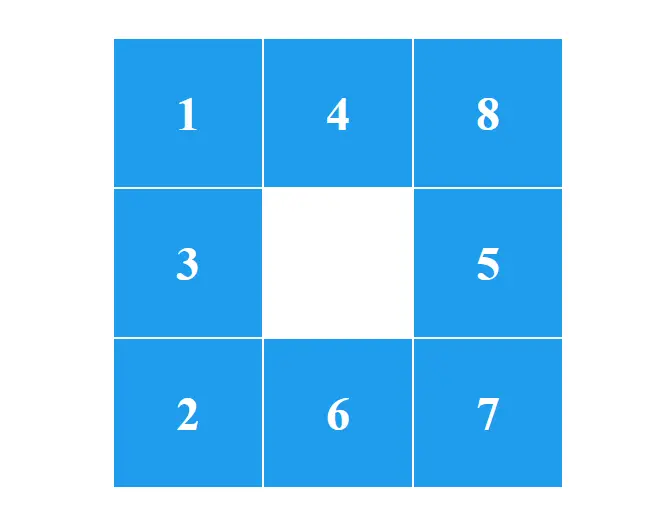
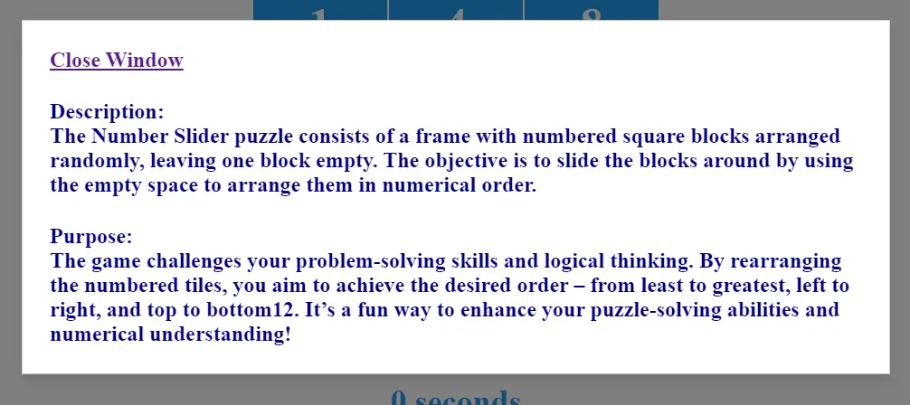

# Number Slider Game

Number slider puzzle is a classic game where user is presented with a grid of numbered tiles and an empty space. The goal is to slide the tiles around, using the empty space, to arrange them in numerical order. It's a puzzle that requires strategic thinking and planning to solve efficiently.

[**Live content over this link**](https://silver25.github.io/number-slider/)

## Introduction

**Purpose of the Project**

The objective of this project is to demonstrate how static HTML pages can incorporate interactivity.  
The interactivity of the Number Slider Puzzle lies in its engaging and hands-on gameplay. User interact with the puzzle by clicking or tapping on the tiles adjacent to the empty space, sliding them into the gap. This movement allows user to rearrange the numbers, aiming to achieve the correct sequence.  
**Disclaimer:** Currently, the Project is for educational purposes only and without any relation to eventual existing real-life similarities.

### Technologies Used

- HTML
- CSS
- JavaScript

## Present Features across the Project

1. Header of the page with Title and link to reload page  

   

2. Game board - main active part of the page with interactive elements  

  

3. Counter for time spend playing  

  

4. Action buttons with options to affect on flow of the game   

  

5. Pop-up window with instructions how to play game  

  

6. Footer of the page with social media icons  

## Future Features on Stand-by

1. Increasing the grid of the game, more tiles
2. Switch button for the game difficulty
3. Choosing tiles face between numbers, images or symbols

## Testing

### Manual Testing

### Validator Testing

## Deployment

### Local Deployment

In order to test and view an interactiv project locally, it is necessary to establish a basic server environment on the personal computer. This setup effectively simulates a web hosting service while operating on a private machine.  
Basically, all files can be in one folder on the private computer, where the preview of the updated code is accessed through the browser.

JavaScript code can run offline in a browser because it's a client-side scripting language. This means the code is executed directly within the user's browser, without requiring constant communication with a server. (Browsers can cache static resources like HTML, CSS, and JavaScript files for offline access.)

In essence, JavaScript's ability to operate independently within the browser, combined with browser-level caching and storage mechanisms, makes offline functionality possible.

### Cloud Deployment

Here's a step-by-step process for deploying Project on GitHub Pages:  

- **Prepare your Website Files**
  - Build your website files locally using your preferred framework (HTML, CSS, Javascript etc.).
  - Ensure your website has an index.html, index.md, or README.md file, as GitHub Pages looks for this as the entry point.
  - Organize your website files into a clear structure for easy navigation.
- **Create a GitHub Repository**
  - If you don't have one already, create a new account and repository on GitHub.com.
  - Push your website files to the newly created repository using Git commands or the GitHub desktop application.
- **Configure Publishing Source (Using Branch)**
  - Go to your repository settings on GitHub.
  - Navigate to the "*Code and automation*" section and click "*Pages*".
  - Under "*Build and deployment*", choose "*Deploy from a branch*" in the "*Source*" section.
  - Select the branch containing your website files from the "*Branch" dropdown menu. Optionally, choose a specific folder within the branch using the "*Folder" dropdown menu (useful for subdirectory deployments).
  - Click "*Save*" to activate your website deployment.
- **Accessing Your Deployed Website**
  - This live site game is on the location: *https://silver25.github.io/number-slider/*

## Credits

[JavaScript Tutorial - W3Schools](https://www.w3schools.com/Js/)  

[The Modern JavaScript Tutorial](https://javascript.info/)  

[JavaScript code snippet by Natalie Girard](https://www.codehim.com/vanilla-javascript/)  

[Build an 8 Puzzle Game](https://javascript.plainenglish.io/build-an-8-puzzle-game-with-pure-javascript-efe424bc252a)  

[How To Make Slide Puzzle Game](https://rocoderes.com/slide-puzzle-game-in-html-css-and-javascript/)  

[Sliding Image Puzzle](https://codingartistweb.com/2023/03/sliding-image-puzzle-javascript/)  

[Build a Sliding Puzzle Game](https://labex.io/courses/project-build-a-sliding-puzzle-game-with-javascript)  

[Free AI Paragraph Rewriter](https://ahrefs.com/writing-tools/paragraph-rewriter)

[How responsive design looks across different browsers](https://ui.dev/amiresponsive)

[Wireframing tool](https://wireframe.cc/)